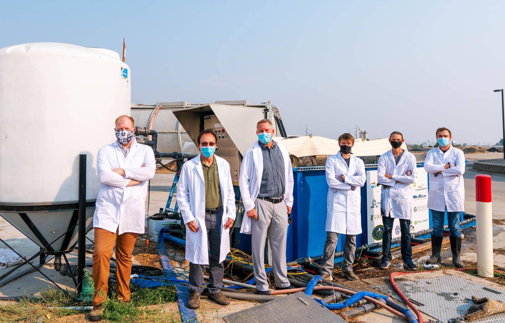

<!-- PROJECT LOGO -->
 

  <a>
    
       
  </a>

  <h1 align="center">Expected Solar & Weather Values</h1>

  

    Jupyter Notebook calculator designed for calculating solar and weather values at a selected point. The project is still being developed and will be updated in the coming months.
     
     
    <a href="https://en.wikipedia.org/wiki/List_of_UTC_time_offsets">UTC Offset</a>
    ·
    <a href="http://www.clearskycalculator.com/">Clear Sky Calculator</a>
    ·
    <a href="https://github.com/nguymon/CIWS-VisChallenge/blob/main/CIWS-VisChallenge.ipynb">Lat/Long Locator</a>
    ·
    <a href="https://www.ncdc.noaa.gov/cdo-web/search">Weather Data</a>
    ·
    <a href="http://clearskycalculator.com/longitudeTZ.htm">Longitude Time Zone</a>
  

<!-- ABOUT THE PROJECT -->
## About The Project

The purpose of this project generate sunlight duration (min), Photosynthetic Photon Flux (µmol m-2 s-1), and average weather values to use in modeling potential growth of Rotating Algae Biofilm Reactors (RABRs).

Here's why:
* Existing online calculators often don't generate data points for entire months but only for a specific day and time.
* Light, temperature, and nutrients are the primary factors driving algae growth.
* Open-source frameworks are needed for developing more comprehensive algae biofilm growth models.

A further description of the project's goals and inspiration can be found here:
* [RABR Overview](https://www.youtube.com/watch?v=0XIu2bFsTW4)
* [Current Project](https://engineering.usu.edu/news/main-feed/2020/usu-biological-engineering-researchers-get-1-9m-doe-grant)

For additional information about the data contact nathan.guymon@aggiemail.usu.edu. For additional information about the RABR project Ronald Sims at ron.sims@usu.edu.

### Built With

The project was built primarily using:
* [**Python** 3.8.5](https://www.python.org/downloads/release/python-384/)
* [**Jupyter Notebook** 1.0.0](https://jupyter.org/)
* [**Pandas** 1.1.3](https://pandas.pydata.org/)
* [**Selenium** 3.141.0](https://selenium-python.readthedocs.io/)

If using a different version of packages it may be necessary to update sections of the project. Also, when using Selenium to browse on the web it is necessary to ensure the [ChromeDriver](https://chromedriver.chromium.org/getting-started) matches the version of Chrome being used by your computer.

<!-- GETTING STARTED -->
## Progress

The project is currently being developed and updates will continue to be posted.

### Current Calculator
Currently the program can carry out basic functions. These are as follows:

* **Solar Calculations** - These include sunrise, sunset, sunlight duration, and other factors. A further description of each can be found at the [Global Monitoring Laboratory](https://www.esrl.noaa.gov/gmd/grad/solcalc/calcdetails.html) website.
* **Solar Radiation** - This is focused on Photosynthetic Photon Flux (µmol m-2 s-1) through web scraping an existing calculator. A further description can be found at the [Apogee Instruments - Clear Sky Calculator](http://www.clearskycalculator.com/) website.
* **Weather Data** - The calculator uses existing climate normals generated by the National Oceanic and Atmospheric Administration. The calculator currently supports only hourly normals. Datasets can be downloaded at the [Climate Data Online Search](https://www.ncdc.noaa.gov/cdo-web/search) website.

### Current Jupyter Notebooks
There are currently three main Jupyter Notebook for the project:
* **Solar & Weather Calculator - Hourly** - This is used for calculating the PPF at Salt Lake City, UT where hourly weather normals are available.
* **Solar & Weather Calculator - Daily** - This is used for calculating the PPF at Logan, UT where daily weather normals are available.
* **Solar & Weather Calculator - Visualizations** - This is used for visualizing the data using Matplotlib.

### Future Goals
The current short term goals are:

* Add support for different weather datasets as hourly normals are only found in specific locations.
* Add support for Daylight Savings Time.
* Increase the flexibility and usability of the calculators by integrating them into an interactive webpage.

<!-- LICENSE -->
## License

Distributed under the MIT License. See `LICENSE` for more information.

<!-- CONTACT -->
## Contacts

Nathan Guymon (code questions) - nathan.guymon@aggiemail.usu.edu

Ronald Sims, PhD (code questions) - ron.sims@.usu.edu

If your are interested in the Rotating Algae Biofilm Reactor project or contributing to the calculator feel free to reach out to either of us.

<!-- ACKNOWLEDGEMENTS -->
## Acknowledgements
* [README Template](https://github.com/othneildrew/Best-README-Template)

  <a>
    
       
  </a>
  
  Part of the team by the Rotating Algae Biofilm Reactor.